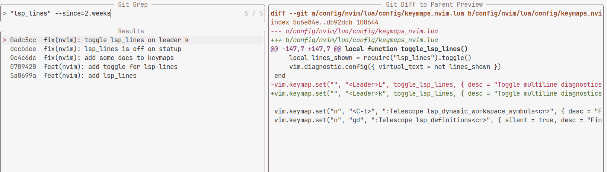

# Telescope git grep



## Installation

With `lazy.nvim`:

```lua
{
    "nvim-telescope/telescope.nvim",
    dependencies = {
        ...
        "barklan/telescope-git-grep.nvim",
    },
    config = function()
        local gitgrep_actions = require("telescope-git-grep.actions")

        require("telescope").setup({
            extensions = {
                git_grep = {
                    auto_quoting = true,
                    mappings = {
                        i = {
                            ["<C-k>"] = gitgrep_actions.quote_prompt(),
                            ["<C-s>"] = gitgrep_actions.quote_prompt({ postfix = ' --since=' }),
                        },
                    },
                },
            },
        })
        require("telescope").load_extension("git_grep")
    end,
}
```

## Usage

```lua
vim.keymap.set(
    "n",
    "<leader>fg",
    ":lua require('telescope').extensions.git_grep.git_grep()<CR>",
    { silent = true, desc = "git grep" }
)
vim.keymap.set(
    "n",
    "<leader>fb",
    ":lua require('telescope').extensions.git_grep.git_bgrep()<CR>",
    { silent = true, desc = "git grep buffer" }
)
```

## Acknowledgements

This is basically a slightly mod of [telescope-live-grep-args.nvim](https://github.com/nvim-telescope/telescope-live-grep-args.nvim).
